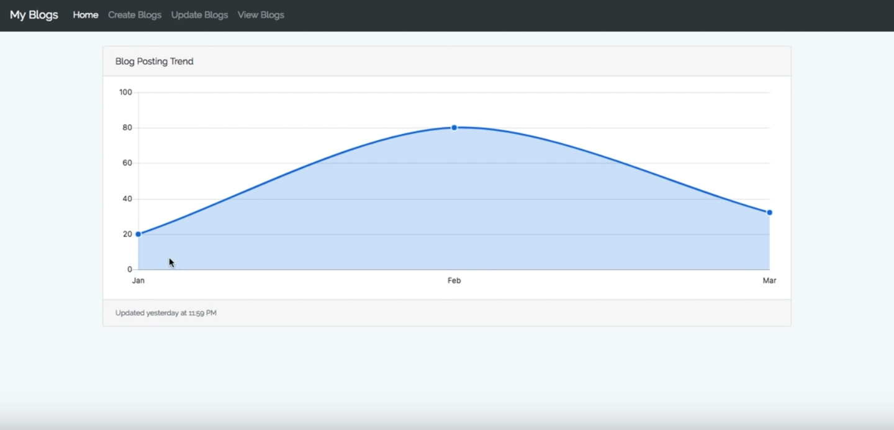

# Laravel Blogs and Charts
:bar_chart: A demo for laraver Blogs and Charts

# Installation :wrench:

1. `git clone https://github.com/imranhsayed/laravel-charts`
2. `cd laravel-charts`
3. `npm install`
4. `composer install`
5. Rename `.env.example` file to `.env`
6. Generate a key by running `php artisan key:generate`
7. `php artisan serve`
8. Now you can see your project at `http://127.0.0.1:8000`

# Video Tutorial :video_camera:

1. [Create Charts in Laravel](https://youtu.be/HGPLf8JBDs4)
